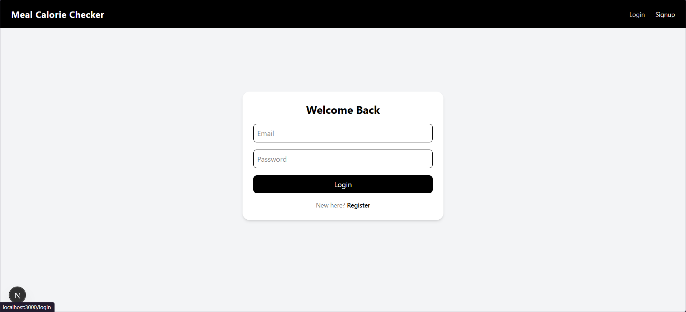
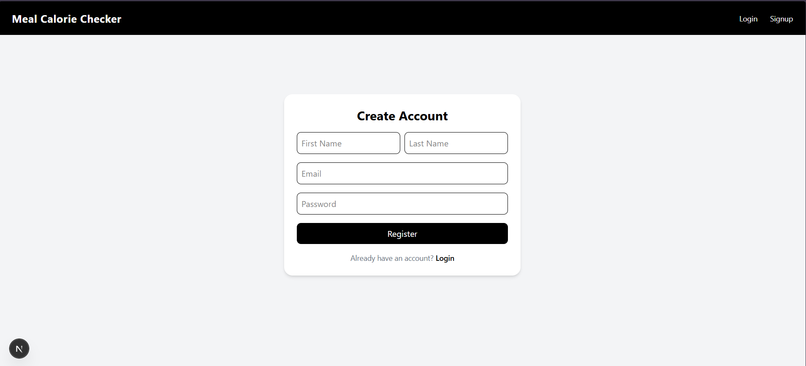
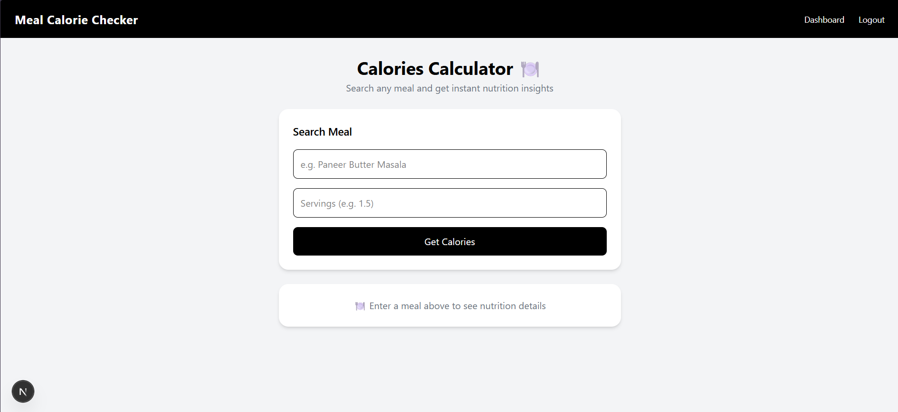
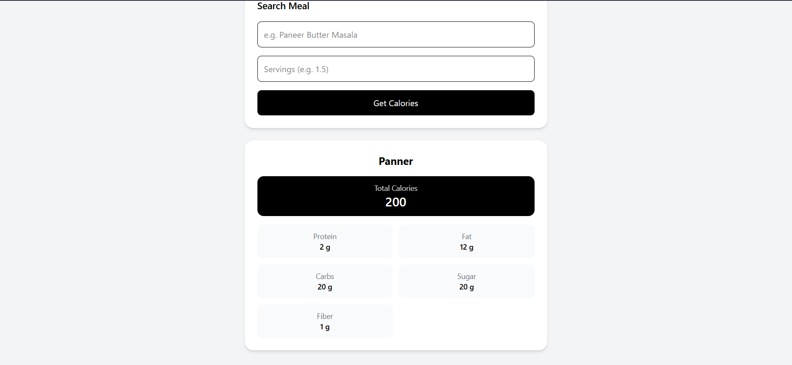
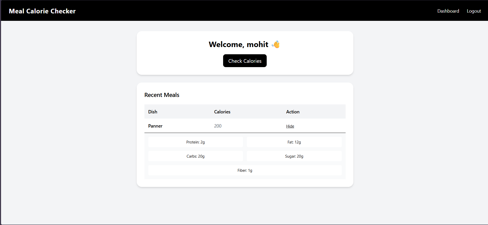

# 🍽️ Calories Tracker App

A modern full-stack web application to calculate meal calories, track nutrition, and manage user history — built with production-level patterns.

---

## 🚀 Live Demo

👉 **Deployed App:** https://meal-calorie-frontend-arya-rajput-dev.vercel.app

---

---

## Screenshots











---

## ✨ Features

### 🔐 Authentication

* User login & registration
* Form validation with Zod
* Global auth state management

### 🍱 Meal Calories Calculator

* Search any dish with servings
* Fetch calorie + macronutrient data
* Real-time results display

### 📊 Nutrition Breakdown

* Calories (highlighted)
* Protein, Fat, Carbs, Sugar, Fiber
* Clean, card-based UI

### 🕘 Meal History

* Stored in global state
* Displayed in table format
* Click-to-expand for details


## 🧱 Tech Stack

### Frontend

* Next.js (App Router)
* React Hook Form
* Zod (validation)
* Tailwind CSS

### State Management

* Zustand

### API Handling

* Axios / Fetch
* Centralized error handling (429 retry logic)

---

## ⚙️ Installation & Setup

### 1. Clone the repo

```bash
git clone https://github.com/AryaRajput1/meal-calorie-frontend-arya-rajput
cd meal-calorie-frontend-arya-rajput
```

### 2. Install dependencies

```bash
npm install
```

### 3. Run locally

```bash
npm run dev
```

---

## 🌍 Environment Variables

Create a `.env.local` file:

```env
NEXT_PUBLIC_API_URL=your_api_url
```

---

## 👤 Author

**Arya Rajput**
Frontend Developer (React / Next.js)